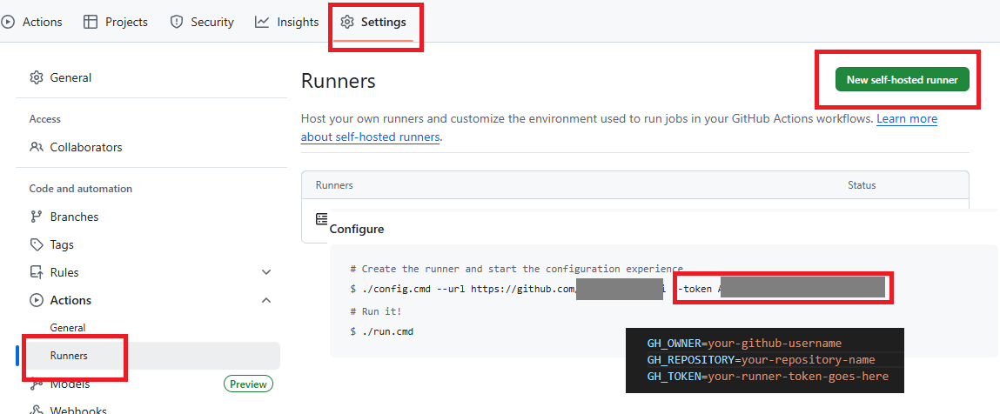
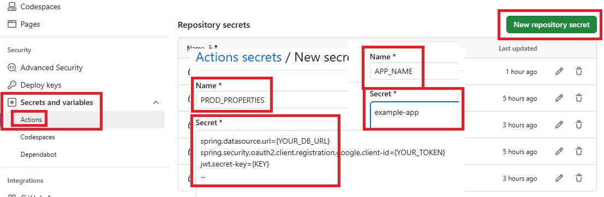

# GitHub Actions Runner with Docker

This project allows you to run a self-hosted GitHub Actions runner using Docker and Docker Compose.

## Prerequisites

- [Docker](https://www.docker.com/get-started)
- [Docker Compose](https://docs.docker.com/compose/install/)

## Included Components

The Docker image is built on Ubuntu 22.04 and includes the following:

- **Base OS:** Ubuntu 22.04
- **System Dependencies:** `curl`, `git`, `jq`, `openssh-client`, `rsync`, `sudo`
- **Node.js:** v18.x
- **GitHub Actions Runner**
- **Runner Dependencies:** (e.g., `libicu` and others installed by `installdependencies.sh`)

## Setup

**Create a `.env` file:**

Create a `.env` file in the project root and add your GitHub Personal Access Token (PAT). You need to create a [Personal Access Token](https://github.com/settings/tokens) with the `repo` scope.

```env
GH_OWNER=<your-github-username>
GH_REPOSITORY=<your-repository-name>
GH_TOKEN=<your-github-token>
```



Docker Compose will automatically use this `.env` file to set the `GH_TOKEN` environment variable for the runner container.

> **Important:** You should only need to set a new token in the `.env` file in specific situations where you intentionally bring the runner container down and then back up (e.g., `docker-compose down` and `docker-compose up`).

**Editor Line Endings:**

When working with Docker Compose files and other scripts, ensure your text editor is configured to use **LF (Line Feed)** as the line ending style. Using CRLF (Carriage Return Line Feed) can cause issues, especially in Linux-based Docker containers.

**GitHub Settings - Secrets and Variables:**

You need to register your Ubuntu account username as a secret or variable in your GitHub repository settings. Go to **Settings > Secrets and variables > Actions** and add a new repository secret/variable named `USERNAME` with your Ubuntu account username as its value.



**Update your GitHub Actions workflow file:**

In your GitHub Actions workflow file (e.g., `<project>/.github/workflows/<github_action.yml>`), change the `runs-on` value to `runs-on: [self-hosted, linux]` to utilize the self-hosted runner.

## Running the Runner

Once you have configured your `docker-compose.yml` and created the `.env` file, you can start the runner with the following command:

```bash
docker-compose up -d --build
```

This command will build the Docker image and start the container in detached mode.

## Verifying the Runner

Go to your GitHub repository's **Settings > Actions > Runners**. You should see your new self-hosted runner listed there with an "Idle" status.

## Managing the Runner

### Stopping the Runner

To stop the container without removing it:

```bash
docker-compose stop
```

### Stopping and Removing the Runner

To stop and remove the container, run:

```bash
docker-compose down
```

### Checking Logs

To view the runner's logs in real-time:

```bash
docker-compose logs -f
```

### Accessing the Container

To open a bash shell inside the running container for debugging:

```bash
docker exec -it my-actions-runner bash
```
